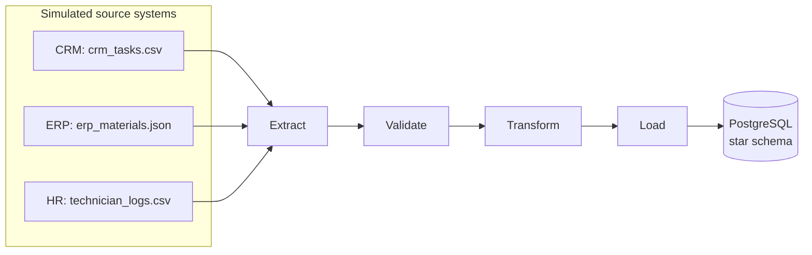

# Telecom Ops Pipeline


A small, containerized ETL pipeline simulating data integration for a telecom field-operations
scenario: work orders from a CRM system, material usage from an ERP-style export, and technician
logs from three independent source systems — extracted, validated, transformed into a star schema,
and loaded into PostgreSQL. Orchestrated with Airflow, tested with pytest, linted with ruff, and
verified end-to-end on every push via GitHub Actions.

Built as a hands-on portfolio project to practice the exact stack required for a Data Engineer role:
SQL, Python, PostgreSQL, Docker, Git, ETL/ELT, DWH modeling, Airflow orchestration, and CI/CD.

## Architecture



Orchestration layer (Airflow DAG, one task per pipeline stage, with a file-based staging area
between tasks instead of passing raw data through XCom):


## Tech stack

| Layer | Tool |
|---|---|
| Language | Python 3.12 |
| Database | PostgreSQL 16 |
| Containerization | Docker, Docker Compose |
| Orchestration | Apache Airflow 2.10 (standalone mode) |
| Testing | pytest |
| Linting | ruff |
| CI/CD | GitHub Actions |

## Project structure

```
telecom-ops-pipeline/
├── .github/workflows/ci.yml      # lint + unit tests + full integration test
├── dags/
│   └── etl_pipeline_dag.py       # Airflow DAG (extract → validate → transform → load → cleanup)
├── data/
│   ├── raw/                      # generated synthetic source files (gitignored)
│   ├── staging/                  # per-run intermediate files used by the DAG (gitignored)
│   └── quarantine/               # rows that failed validation, kept for review (gitignored)
├── scripts/
│   ├── generate_fake_data.py     # synthetic data generator (Faker)
│   └── run_pipeline.py           # standalone pipeline runner (used by the Docker app image)
├── sql/
│   └── schema.sql                # star schema DDL, auto-applied on first Postgres start
├── src/
│   ├── extract.py
│   ├── validate.py
│   ├── transform.py
│   └── load.py
├── tests/
├── docker-compose.yml            # postgres + app + airflow services
├── Dockerfile                    # app image
├── requirements.txt
└── .env.example
```

## Data model

Star schema: one fact table, three dimensions.

- `fact_work_orders` — one row per work order, with a `task_id` natural key (unique, upserted on
  reload for idempotency) and foreign keys into the dimensions below.
- `dim_technician`, `dim_material`, `dim_date` — descriptive attributes, deduplicated on load.

## Getting started

**Prerequisites:** Docker Desktop, Python 3.12+.

```bash
# 1. Set up Python environment
python -m venv venv
.\venv\Scripts\activate        # Windows
pip install -r requirements.txt

# 2. Copy env template
cp .env.example .env

# 3. Generate synthetic source data
python scripts/generate_fake_data.py

# 4. Start the full stack (Postgres + app + Airflow)
docker-compose up --build -d
```

Postgres schema is created automatically on first start (via `docker-entrypoint-initdb.d`) — no
manual migration step needed on a fresh setup.

## Running the pipeline

**One-off run** (via the `app` container, runs once and exits):
```bash
docker-compose up --build -d app
docker logs telecom_ops_app
```

**Orchestrated run** (via Airflow):
1. Open `http://localhost:8080`
2. Log in as `admin` (password: `docker exec telecom_ops_airflow cat /opt/airflow/standalone_admin_password.txt`)
3. Enable and trigger the `telecom_ops_etl` DAG

Both paths are idempotent — running either one multiple times on the same source data updates
existing rows (matched by `task_id`) instead of duplicating them.

## Testing

```bash
pytest -v
```

Unit tests cover `extract`, `validate`, `transform`, and `load` in isolation (no live database
required). CI additionally runs a full integration test: builds the app image, starts Postgres,
runs the real pipeline against a fresh database, and asserts that rows actually landed in
`fact_work_orders`.

## CI/CD

Every push to `main` runs, via GitHub Actions:
1. **`unit-tests`** — ruff lint + pytest (no external dependencies)
2. **`integration-test`** — builds the Docker image, spins up Postgres + app, waits for the
   pipeline to finish, and verifies row counts directly in the database before tearing everything down

## Design decisions & known simplifications

Documented honestly, since these are the kind of trade-offs worth being able to explain out loud:

- **Validation quarantines bad rows instead of blocking the whole run.** A row that fails
  validation (e.g. a task with a zero `duration_minutes`, or a material pointing at a
  non-existent task) is set aside in `data/quarantine/<run_id>.json` along with the reason(s)
  it was flagged, and excluded from that run's load — the rest of the batch still loads
  normally. This is a deliberate choice over failing the whole pipeline on any validation
  error: at this data volume, a handful of malformed rows from one source system shouldn't
  block the other 999 good ones. Quarantining is for row-level *data quality* problems only —
  systemic failures (unreachable database, missing source file) still raise and stop the
  pipeline immediately, since those aren't something a quarantine table can fix. If a
  material's task was itself quarantined, the material cascades into quarantine too, even if
  it individually passed validation, since it would otherwise have nothing valid to attach to.
- **One material per fact row.** A work order can use several materials, but `fact_work_orders`
  stores a single `material_id`. Quantity and cost are summed across all materials for that task;
  the "representative" material is just the first one seen. A fully correct model would use a
  bridge table for the task↔material many-to-many relationship.
- **JSON staging files, not Parquet.** The Airflow DAG passes data between tasks via small JSON
  files rather than through XCom directly, to avoid XCom's size limits — a real pattern for
  larger datasets. At this data volume, Parquet would be the natural next upgrade (smaller files,
  preserved types) but wasn't necessary to prove the pattern.
- **Airflow in standalone mode.** Uses SQLite metadata storage and a sequential executor —
  intentionally lightweight for local development, not representative of a production Airflow
  deployment (which would use PostgreSQL/MySQL for metadata and CeleryExecutor or KubernetesExecutor).

## Possible next steps

- Bridge table for task↔material instead of the single-material simplification
- Parquet instead of JSON for staging files
- Quarantine records in a proper Postgres table instead of JSON files, so they're queryable
  and can back a simple "data quality" dashboard instead of requiring someone to open a file
- Kafka producer/consumer to demonstrate event-driven ingestion alongside the batch pipeline
- dbt for the transformation layer instead of hand-written SQL