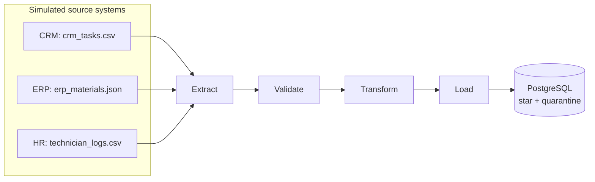
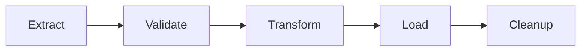

# Telecom Ops Pipeline


A small, containerized ETL pipeline simulating data integration for a telecom field-operations
scenario: work orders from a CRM system, material usage from an ERP-style export, and technician
logs from three independent source systems — extracted, validated, transformed into a star schema,
and loaded into PostgreSQL. Orchestrated with Airflow, tested with pytest, linted with ruff, and
verified end-to-end on every push via GitHub Actions.

Built as a hands-on portfolio project to practice the exact stack required for a Data Engineer role:
SQL, Python, PostgreSQL, Docker, Git, ETL/ELT, DWH modeling, schema migrations, Airflow
orchestration, and CI/CD.

## Architecture



Orchestration layer (Airflow DAG, one task per pipeline stage, with a file-based staging area
between tasks instead of passing raw data through XCom):



## Tech stack

| Layer | Tool |
|---|---|
| Language | Python 3.12 |
| Database | PostgreSQL 16 |
| Containerization | Docker, Docker Compose |
| Orchestration | Apache Airflow 2.10 (standalone mode) |
| Testing | pytest |
| Linting | ruff |
| Schema migrations | Alembic |
| Staging (DAG) | Parquet via pyarrow |
| CI/CD | GitHub Actions |

## Project structure

```
telecom-ops-pipeline/
├── .github/workflows/ci.yml      # lint + unit tests + full integration test
├── dags/
│   └── etl_pipeline_dag.py       # Airflow DAG (extract → validate → transform → load → cleanup)
├── data/
│   ├── raw/                      # generated synthetic source files (gitignored)
│   └── staging/                  # per-run intermediate files used by the DAG (gitignored)
├── scripts/
│   ├── generate_fake_data.py     # synthetic data generator (Faker)
│   └── run_pipeline.py           # standalone pipeline runner (used by the Docker app image)
├── migrations/
│   ├── env.py                    # builds the DB URL from the same env vars load.py uses
│   └── versions/                 # one file per schema change, in order
├── alembic.ini
├── sql/
│   └── schema.sql                # historical reference only - not applied automatically
│                                  # anymore, see migrations/ instead
├── src/
│   ├── pipeline.py               # shared validate/split/transform used by DAG and standalone
│   ├── extract.py
│   ├── validate.py
│   ├── quarantine.py
│   ├── transform.py
│   ├── load.py
│   ├── staging.py                # Parquet handoffs between Airflow tasks
│   ├── logging_config.py
│   └── alerting.py               # posts to a chat webhook on task failure (on_failure_callback)
├── tests/
├── docker-compose.yml            # postgres + migrate + app + airflow services
├── Dockerfile                    # app image
├── requirements.txt
└── .env.example
```

## Data model

Star schema: work-order facts, material-line facts, three dimensions.

- `fact_work_orders` — one row per work order (`task_id` unique, upserted on reload).
- `fact_work_order_materials` — one row per material used on a work order
  (`task_id` + `material_id` unique); quantity and line cost live here, not on the header.
- `dim_technician` and `dim_material` — SCD1 (`region` / `hire_date` / `unit_cost`).
  `dim_date` is insert-only.
- `quarantine_records` — append-only review queue for rows excluded from the star load
  (`pipeline_run_id`, source system, original row as JSONB, error messages).

## Getting started

**Prerequisites:** Docker Desktop, Python 3.12+.

```bash
# 1. Set up Python environment
python -m venv venv
.\venv\Scripts\activate        # Windows
pip install -r requirements.txt -r requirements-dev.txt
```
`requirements-dev.txt` pulls in `requirements.txt` too, plus `Faker` (needed by
`scripts/generate_fake_data.py` in step 3), `pytest`, and `ruff`. The Docker image itself only
ever installs the runtime-only `requirements.txt` — see the Dockerfile.

```bash
# 2. Copy env template
cp .env.example .env

# 3. Generate synthetic source data
python scripts/generate_fake_data.py

# 4. Start the full stack (Postgres + migrate + app + Airflow)
docker compose up --build -d
```

The `migrate` service runs `alembic upgrade head` against Postgres and exits; `app` and `airflow`
both wait for it to finish successfully (`depends_on: migrate: condition: service_completed_successfully`)
before starting, so the schema always exists before anything tries to use it — on a fresh database
just as much as on one that already has data from a previous version of the schema.

## Managing schema changes

Schema changes go through Alembic, not hand-edited SQL. To make a change:

```bash
# 1. Write a new revision (autogenerate won't find anything - there are no
#    ORM models in this project, load.py uses raw SQL - so write upgrade()/
#    downgrade() by hand)
alembic revision -m "describe the change"

# 2. Edit the generated file in migrations/versions/, then apply it
alembic upgrade head

# 3. Sanity-check you can also undo it
alembic downgrade -1
alembic upgrade head
```

`migrations/env.py` builds the connection URL from the same `DB_HOST` / `POSTGRES_*` environment
variables `load.py` already uses, so there's nothing extra to configure locally beyond the usual
`.env`.

## Running the pipeline

**One-off run** (via the `app` container, runs once and exits):
```bash
docker compose up --build -d app
docker logs telecom_ops_app
```

**Orchestrated run** (via Airflow):
1. Open `http://localhost:8080`
2. Log in as `admin` (password: `docker exec telecom_ops_airflow cat /opt/airflow/standalone_admin_password.txt`)
3. Enable and trigger the `telecom_ops_etl` DAG

Both paths are idempotent — running either one multiple times on the same source data updates
existing rows (matched by `task_id`) instead of duplicating them.

## Alerting

Failure notifications are off by default. To turn them on:

1. Create a webhook — for Discord: server settings → Integrations → Webhooks → New Webhook, copy
   the URL. For Slack: create an app at [api.slack.com/apps](https://api.slack.com/apps), enable
   Incoming Webhooks, install it to your workspace.
2. Add to `.env`:
   ```
   ALERT_WEBHOOK_URL=https://discord.com/api/webhooks/xxxxx/yyyyy
   ALERT_WEBHOOK_TYPE=discord   # or "slack"
   ```
3. Restart the `airflow` container. Any task failure in `telecom_ops_etl` now posts to that
   webhook — DAG id, task id, run id, the exception, and a link straight to the task's logs.

Without `ALERT_WEBHOOK_URL` set, the DAG behaves exactly as before — `notify_on_failure()` logs
that it's skipping and returns, nothing else changes.

## Testing

```bash
pytest -v
```

Unit tests cover `extract`, `validate`, `transform`, and `load` in isolation (no live database
required). CI additionally runs a full integration test: builds the app image, starts Postgres,
runs the real pipeline against a fresh database, and asserts that rows actually landed in
`fact_work_orders`.

## CI/CD

Every push to `main` (and every pull request targeting `main`) runs, via GitHub Actions:
1. **`unit-tests`** — ruff lint + pytest (no external dependencies)
2. **`dag-validation`** — imports the DAG with Airflow 2.10 (constrained) and checks that
   `telecom_ops_etl` loads with the expected five tasks
3. **`integration-test`** — builds the Docker image, spins up Postgres + app, fails if the
   app container exits non-zero, verifies row counts in the database (facts and material
   lines), then runs the pipeline a second time and asserts those counts did not double
   (upsert)

## Design decisions & known simplifications

Documented honestly, since these are the kind of trade-offs worth being able to explain out loud:

- **Validation quarantines bad rows instead of blocking the whole run.** A row that fails
  validation (e.g. a task with a zero `duration_minutes`, or a material pointing at a
  non-existent task) is written to `quarantine_records` in Postgres along with the reason(s)
  it was flagged, and excluded from that run's star load — the rest of the batch still loads
  normally. DQ is committed in its own transaction *before* the star schema load, so a later
  fact failure does not lose the review queue. The DAG may park the same payload in staging
  Parquet between `validate` and `load`; those files are transfer only and are deleted with the
  rest of staging after a successful run — Postgres is the source of truth. This is a deliberate
  choice over failing the whole pipeline on any validation error: at this data volume, a
  handful of malformed rows from one source system shouldn't block the other 999 good ones.
  Quarantining is for row-level *data quality* problems only — systemic failures (unreachable
  database, missing source file) still raise and stop the pipeline immediately, since those
  aren't something a quarantine table can fix. If a material's task was itself quarantined,
  the material cascades into quarantine too, even if it individually passed validation, since
  it would otherwise have nothing valid to attach to. A CRM technician who is not in the HR
  logs is treated the same way as a missing name: the task is quarantined rather than loaded
  with a NULL `technician_id`. Invalid dates, non-numeric material quantities, and negative
  costs are also row-level (a bad material does not take sibling materials for the same task
  with it). Quarantine rows are append-only per pipeline run (a reload adds another review
  batch; it does not upsert away the previous one).
- **Dimensions follow SCD1 except `dim_date`.** Reloading source data overwrites `dim_technician.region` /
  `hire_date` and `dim_material.unit_cost`. Calendar dates are immutable, so `dim_date` stays
  insert-only (`ON CONFLICT DO NOTHING`).
- **DAG cleanup deletes staging only after a successful load.** A failed run leaves
  `data/staging/<run_id>/` in place for debugging. Airflow `run_id` values are sanitized
  (`:` / `+` → `_`) so staging paths are legal on Windows NTFS bind-mounts. Extract and load
  retry twice with exponential backoff; validate, transform, and cleanup do not.
- **Schema changes go through Alembic, with real "before/after" migrations.** The very first
  version of `fact_work_orders.task_id` had no `UNIQUE` constraint, which was added later by hand
  via `psql` once the upsert logic in `load_facts()` needed something to `ON CONFLICT` against —
  and that fix only ever got folded into `sql/schema.sql` as the new "final" state, with no
  record of how to get an *existing*, already-populated database from the old shape to the new
  one. `migrations/versions/` now reproduces that exact history as two migrations: `0001` creates
  the original schema (no constraint), `0002` adds it — rather than one migration that already
  has the fix baked in. This was verified against a real Postgres instance with data already
  inserted under the old schema: `alembic upgrade head` added the constraint without touching the
  existing rows, which is the actual point of a migration tool over a "current state" SQL file.
  A later revision adds `fact_work_order_materials` and drops the collapsed material columns
  from `fact_work_orders`; existing fact rows cannot be exploded back into lines, so an
  upgraded database needs a pipeline reload from source. Another revision adds
  `quarantine_records` for the DQ review queue.
- **Parquet staging files between Airflow tasks, not XCom payloads.** The DAG passes
  file paths through XCom and writes row batches to `data/staging/<run_id>/*.parquet`
  via `src/staging.py` (pyarrow). That avoids XCom size limits and keeps column types
  intact compared to JSON. The standalone `scripts/run_pipeline.py` path stays in-memory
  — it does not need staging files at this volume. `pyarrow` ships in `requirements.txt`
  and in the Airflow container via `_PIP_ADDITIONAL_REQUIREMENTS` in `docker-compose.yml`.
- **The DAG and the standalone script connect to Postgres two different ways, on purpose.**
  `dags/etl_pipeline_dag.py`'s `load_task` uses `PostgresHook(postgres_conn_id="postgres_default")`
  — Airflow's own mechanism for looking up database credentials by a Connection ID, rather than
  reading them from `.env` inside task code. `scripts/run_pipeline.py`, which runs standalone
  outside Airflow (e.g. via the `app` container), keeps using `load.py`'s `get_connection()` /
  `os.getenv()` — Airflow Connections simply don't exist outside of Airflow, so there's nothing
  "more correct" to switch it to. The Connection itself is defined via the
  `AIRFLOW_CONN_POSTGRES_DEFAULT` environment variable in `docker-compose.yml` rather than created
  by hand in the UI or via `airflow connections add` — the honest trade-off here is that an
  env-var Connection isn't a row in the metadata DB, so it isn't editable from the Connections
  page the way a UI-created one is; changing it means changing the env var (and restarting the
  container), not touching DAG code either way, which was the actual goal.
- **Airflow in standalone mode.** Uses SQLite metadata storage and a sequential executor —
  intentionally lightweight for local development, not representative of a production Airflow
  deployment (which would use PostgreSQL/MySQL for metadata and CeleryExecutor or KubernetesExecutor).
- **Failure alerts go to a chat webhook, via `on_failure_callback`.** Set via `default_args` on
  the DAG, so it applies to every task, not just one — if the DAG fails unattended (e.g. at 3am),
  `src/alerting.py` posts to whatever webhook `ALERT_WEBHOOK_URL` points at (Discord by default;
  `ALERT_WEBHOOK_TYPE=slack` switches the payload shape) instead of the failure only being
  noticed the next time someone happens to open the Airflow UI. Deliberately not email: Airflow
  standalone has no SMTP server configured, and adding one is a real chunk of extra infrastructure
  (a real mail relay or third-party SMTP credentials) for what a single webhook URL already
  covers. The alert path is defensive on purpose — failures while reading the Airflow context or
  sending the webhook (`KeyError` / `AttributeError` / `requests.RequestException`, plus JSON
  encoding errors) are caught and logged, never re-raised, so a broken webhook cannot compound
  the DAG's own failure handling. The exception text is not logged, because `requests` embeds
  the webhook URL in it. Programming errors inside the callback itself are left to surface.
  Verified against a real Airflow task failure locally (`airflow tasks test`
  with a deliberately unreachable database), not just with a mocked HTTP call in the unit tests.

## Possible next steps

- Kafka producer/consumer to demonstrate event-driven ingestion alongside the batch pipeline
- Email alerting alongside (or instead of) the webhook, once a real SMTP relay is available
- dbt for the transformation layer instead of hand-written SQL